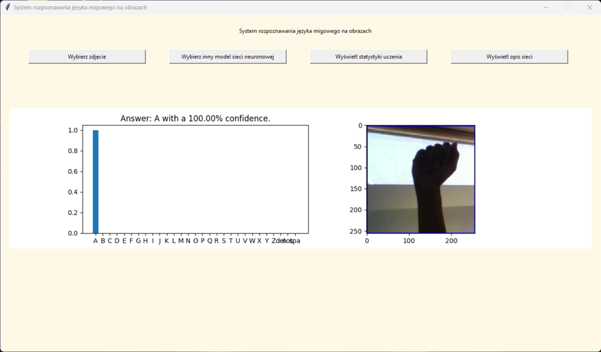
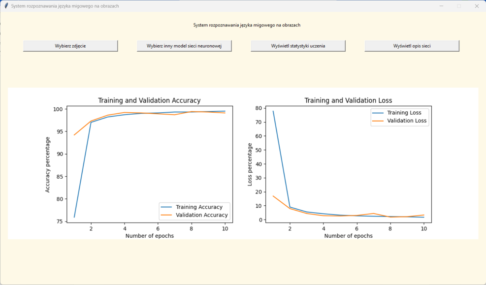

# Sign Language Recognition
System that uses artifical intelligence to recognize individual letters of the
American Sign Language alphabet in pictures. App developed in 2023.

## Technologies Used
### Languages
- Python
### Libraries
- TensorFlow - artificial intelligence
- Matplotlib - plots
- NumPy - math operations
- Tkinter - GUI

## Example Screenshots
### Image Recognition

### Plots

## Contribution
### Dataset
- [Source](https://www.kaggle.com/datasets/grassknoted/asl-alphabet?resource=download-directory)
